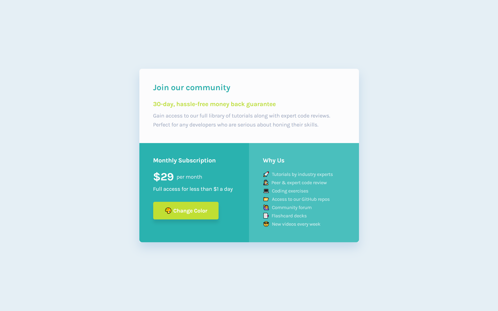

# Frontend Mentor - Single price grid component solution

This is a solution to the [Single price grid component challenge on Frontend Mentor](https://www.frontendmentor.io/challenges/single-price-grid-component-5ce41129d0ff452fec5abbbc). Frontend Mentor challenges help you improve your coding skills by building realistic projects. 

## Table of contents

- [Overview](#overview)
  - [The challenge](#the-challenge)
  - [Screenshot](#screenshot)
  - [Links](#links)
- [My process](#my-process)
  - [Built with](#built-with)
  - [What I learned](#what-i-learned)
  - [Useful resources](#useful-resources)
- [Author](#author)

### Screenshot

### Links

- Solution URL: [Frontend Mentor Solution](https://www.frontendmentor.io/solutions/single-grid-component-vanilla-css-easter-egg-obsZK5BL2p)
- Live Site URL: [Live Site at Vercel](https://single-price-grid-component-rose-gamma.vercel.app/change-color.html)
## My process

### Built with

- Semantic HTML5 markup
- Flexbox
- Grid
- Responsive Design

### What I learned

I learned something really USEFUL!!!😎😎😎 that's how to use emojis inside the HTML! 👻

### Useful resources

- [html css emojis](https://html-css-js.com/html/character-codes/) - CSS HTML Emoji List

## Author
- Github - [correlucas](https://github.com/correlucas/)
- Frontend Mentor - [@correlucas](https://www.frontendmentor.io/profile/correlucas)
